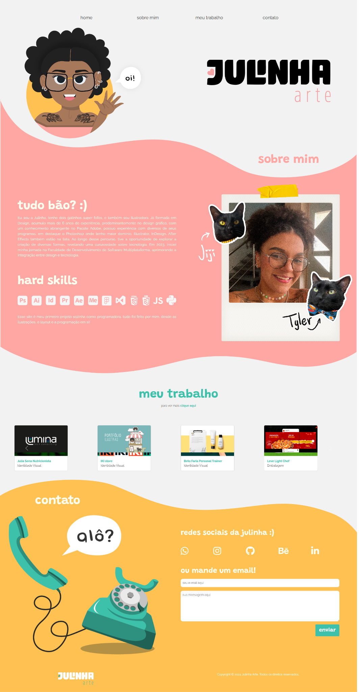

###

<h3 align="left">👩‍🎨  Sobre mim</h3>

###

👋 Oi! Eu sou a Julinha 😊  
Sou formada em Design e acumulo mais de 7 anos de experiência, predominantemente no design gráfico, com um conhecimento abrangente no Pacote Adobe.  
Tenho experiência com diversos de seus programas, em destaque o Photoshop onde tenho maior domínio, Illustrator e InDesign.  
After Effects também está na lista!  

Ao longo desse percurso, tive a oportunidade de explorar a criação de diversas formas, unindo minha curiosidade sobre tecnologia.  
Em 2023, iniciei minha jornada na Faculdade de Desenvolvimento de Software Multiplataforma, aprimorando a integração entre design e tecnologia.

###

  
  
  
  
  

###

<h3 align="left">🛠 Hard Skills:</h3>

###

  
  
  
  
  
  
  
  
  
  
  
  
  
  
  

###

<h3 align="left">✨ Projeto em destaque:</h3>

  
  
<a href="https://julinhaarte.github.io/">🔗 Acesse o projeto completo</a>

###

<h3 align="left">🔥 Stats :</h3>

###

  

